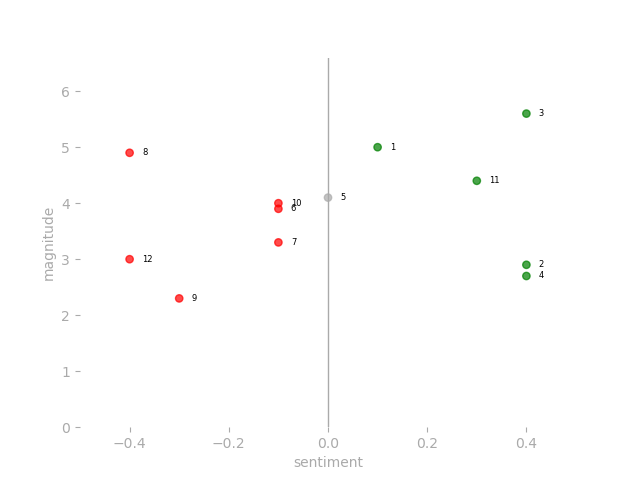
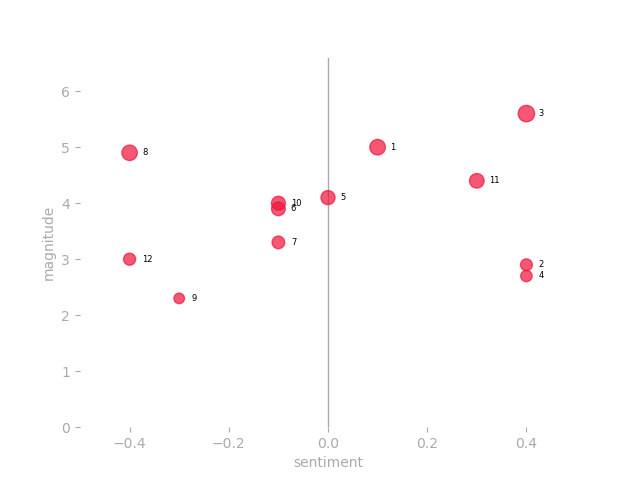
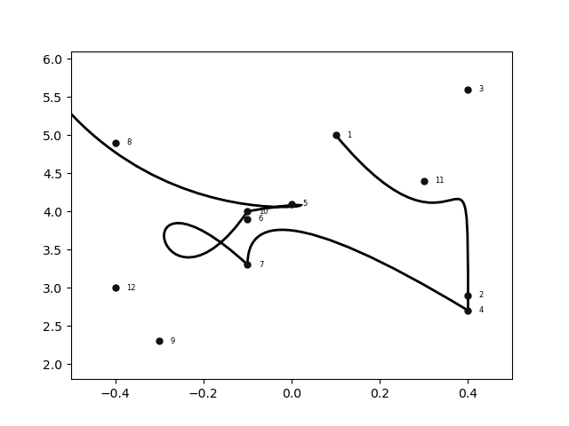
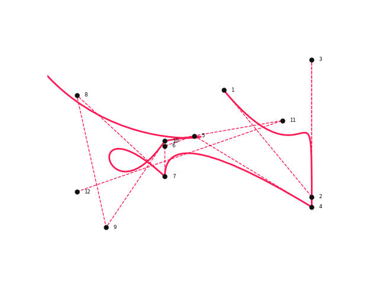
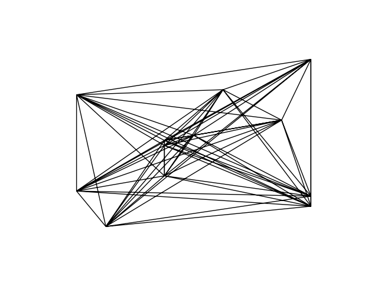

# Avicii Open Data Art Project

You can use this project to analyse text for sentiment using Google Natural Language API and explore the results with data visualisations.

I personally use the visuals to make my own t-shirts of musics that I like.  [Read the origin story](http://www.edriessen.com/projects/the-avicii-project/) to find out why I created this project and why I associate it with Avicii.

# Creating a dataviz of the lyrics of your favourite artist

Good to see that you want to give my repository a try. The process is split into three parts:

1. Analyse the song texts or other text collections
2. Scatter plot visualisation to review the sentiment data
3. Creative path visualisation (data art)

I'll use Avicii's posthumous album TIM as an example in this readme. 

Let's dig in.

# 1. Analyse the song texts or other text collections

To run an analysis, you'll need a connection to the Google Cloud Natural Language API.  Set up a project in the Google Cloud console and add your `credentials.json` to the project root folder. 

After setting it up, you'll need a `.txt` file for each song that you want to analyse. I use https://www.azlyrics.com to get my lyrics. Format each `.txt` file like this: `song index-album name-song title.txt`. 

>  **Example**: For the song Peace of Mind by Avicii, the first song on the album TIM, the file name would be: `1-tim-peace of mind.txt`. 

Store the text files somehwere inside the project folder (the folder `/songs` is listed in the `.gitignore`).  

When you have the files ready, you can use `analyse.py` to run the sentiment analysis and store the results in a csv file. You'll have to provide two arguments:

- path to the folder that contains the text files to analyse, e.g. `songs/avicii tim`.
- name of the csv file that will be stored in the output folder, e.g. `avicii tim`. 

Here's the example listed in `analyse.py`:

```python
if __name__ == '__main__':
    path_to_songs = 'songs/avicii_tim'
    csv_file_name = 'avicii tim'
    analyse_files_and_store_in_csv(path_to_songs, csv_file_name)
```
With the analysis done, you can continue to section 2. 

### Optional: Fetch lyrics automatically from Genius.com
You have the option to fetch the lyrics using the `lyrics.py` file. To use the script, you have to generate an access key on https://genius.com/api-clients. Store the access key in a json file called `credentials-genius.json` with this format:

```
{
  "access-key": "your access key here"
}
```

After that, enter the song titles, artist, and album as appropriate in `lyrics.py`. You will need to create the appropriate folder under the songs folder (for example, for Lady Gaga, you will need to create a `Lady Gaga` folder: `songs/Lady Gaga`). The script will generate the text files and put them in the folder.

_Small changes in the lyrics can impact the visual.
So be sure to check the lyrics when you get them automatically._

# 2. Scatter plot visualisation to review the sentiment data

I've created a class to help you visualise the data in various ways. 

First, we will discuss the scatter plot. This visualisation helps you explore the sentiment data and get familiar with the results. You can review `run-example.py` for a working sample.

The first thing you'll need to do is load the results from your analysis into a dataframe. And after that, create an instance of the VisualiseSentiment class:

```Python
from visualise_sentiment import VisualiseSentiment

df = pd.read_csv('output/avicii tim.csv').sort_values(by='index')

viz_buddy = VisualiseSentiment(
    dataframe=df,
    show_grid=True,
    annotate='index',
)
```
The class takes four arguments:

- dataframe: the data you want to visualise.
- show_grid: boolean that enables or disables grids in plots.
- annotate (optional): string to set annotation values:
	- `''` for no annotation (default)
	- `'index'` to annotate with the index of the data
	- `'title'` to annotate with the title of the text
	- `'index title'` to annotate with both index and title
- save (optinal): name of the file to save the plot to (e.g. `'example_viz.png'`). Default value is `''` and shows the plot (`plt.show()`).

After creating the instance, you can visualise the results easily using the `scatter_plot()` method. This generates the following results:



You can modify various scatter plot options:

```python
viz_buddy.scatter_dot_color = '#f0123a'
viz_buddy.scatter_dot_fill = False
viz_buddy.scatter_dot_amplifier = 25

viz_buddy.scatter_plot()
```
Which results in:



# 3. Creative path visualisation (data art)

This is where the magic happens. 

Using paths & patches from Matplotlib, you can draw a line from data point to data point. It creates a sort of abstract 'connect the dots' type of drawings. The visual stops being a data visualisation and slow turns into abstract data art.

I currently support ways to get creative:

- 3.1 Signature path
- 3.2 Web path
- 3.3 Dataframe modifications

### 3.1 Signature path (Bezier)

Using the `plot_path()` method, you get the following result by default:



Let's have a look at a clean version of the plot:


Wow, that is some nice abstract data visualisation right?! :)

There are some some options you can set when plotting the path: 

```python
viz_buddy.show_grid = False

viz_buddy.path_colors = ['#ff1a55', '#ff1a55']
viz_buddy.path_styles = ['--', '-']
viz_buddy.path_widths = [1, 2]
viz_buddy.path_types = ['', 'bezier']
    
 viz_buddy.plot_path()
```

_Make sure the lists you provide for the path options have the same length. You have two options for line types: `'bezier'` draws a Bezier curve. Anything else (e.g. `''`) draws a straight line._

And again the result:



This setup nicely shows both the straight path and the Bezier curves that are generated.

Here's another example that plots the same line several times with different colours and widths:

```python
viz_buddy.show_grid = False

viz_buddy.path_colors = ['#E6E6E6', '#F2C641', '#E52133', '#A40454', '#02388viz_buddy.path_F', '#ffffff']
viz_buddy.path_styles = ['-', '-', '-', '-', '-', '-']
viz_buddy.path_widths = [38,30,22,14,8,2]
viz_buddy.path_types = ['bezier', 'bezier', 'bezier', 'bezier', 'bezier', 'bezier']
viz_buddy.path_length = 99
viz_buddy.path_dot_colours = 'none'
    
viz_buddy.plot_path()
```
And the image:


No real purpose for this one, but it's good to know your options :)

There are more options to modify the outcome:

- Change the figsize (and with it the aspect ratio)
- Modify path capstyle and joinstyle
- Add a background marker

. Below is a code example that uses multiple settings:

``````python
viz_buddy.figsize = [7,7]

viz_buddy.path_colors = ['#000000']
viz_buddy.path_styles = ['-']
viz_buddy.path_widths = [6.2]
viz_buddy.path_types = ['bezier']
viz_buddy.path_dot_colors = 'none'

viz_buddy.path_capstyle = 'round'
viz_buddy.path_joinstyle = 'bevel'

viz_buddy.path_bg_shape_size = 40000
viz_buddy.path_bg_shape_color = '#F2E8DC'
viz_buddy.bg_shape_marker = 'v'
viz_buddy.path_plot()
``````

And the result:


### 3.2 Web path

This option draws a line from each data point to every other data point. For this one, I was inspired by a few students that took my course. Some ended up using this project to draw abstract, cubist-like graphics. Really interesting. 

This web path can be generated using the `web_path()` module. It uses the same input as `plot_path()` but only uses the first argument of various input lists.

Here's the same data, shown as a web plot:



And the code snippet that makes this work:

```python
viz_buddy.path_colors = ['#000000']
viz_buddy.path_styles = ['-']
viz_buddy.path_widths = [1]
viz_buddy.path_types = ['']
viz_buddy.path_dot_colours = 'none'

viz_buddy.web_plot()
```

You have the option to use the parameter `line_width_value` when calling `web_plot` and set it to either  `'magnitude'` or `'score'`. This changes the width of lines according to values in the data.

### 3.3 Dataframe modifications

I have included options to draw a different kind of path. 

As discussed, the path is normally drawn based on the order of the songs on an album (or index column in the dataframe). But if you want, you can change it.

#### 3.3.1 Edge shape

This draws a line across the outermost points in the data set. 

Here's an example of the data of Avicii's TIM: 


And the version with a curved path:


Technically, it works like this:

- The script finds the data point with lowest score in the dataframe. 
If there are multiple, it selects the one with the highest magnitude.
- Next, it goes looking for the next data point with a higher score and higher magnitude. 
If there aren't any, it picks the nearest point with a higher score.
- After that, it keeps on looking for data points with a higher score and a max difference of 1.1 in magnitude. 
Again, if there aren't any matches, it picks the nearest point with a higher score.
- When there are no values with a higher scores left, it flips it search. Looking for lower scores and lower magnitudes.
This last check picks up all the remaining data points for the path.

When the edge path order is defined, it adds a copy of the first row of the dataframe as the last row. 
This closes the path into a full loop.

To use this edge path option, you have to filter the data frame. 
You can pass a `start_at` parameter, to have the path start at a point of choosing. 

```python
from custom_path import sort_df_by_starting_point

df = pd.read_csv('output/avicii tim.csv').sort_values(by='index')

df_filtered = sort_df_by_starting_point(
  df=df,
  start_at='bad-reputation'
)
```
#### 3.3.2 Complete bezier path

If you want to make a closed Bezier path, you might need to add a specific number of rows. I've added a function that helps you with that. Call this function before you start visualising to close down a Bezier plot.

``````python
from custom_path import copy_rows_to_df

df = copy_rows_to_df(df)
``````


# To do

Things I'll be working on are:

- Migrate to a free and open alternative to Google's Natural Language API. 

_Suggestions? Please do contact me._
