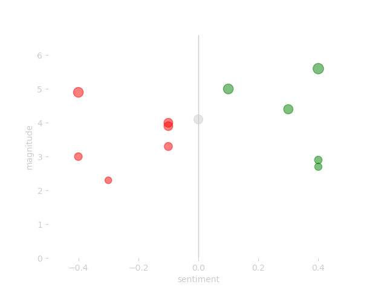
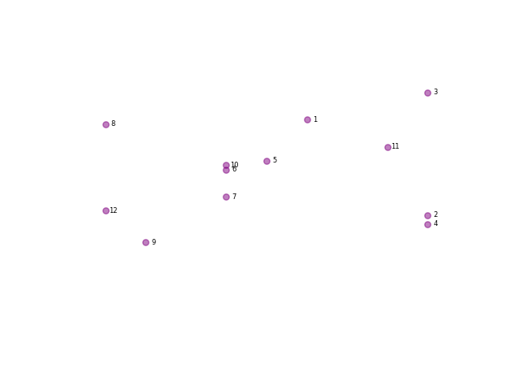
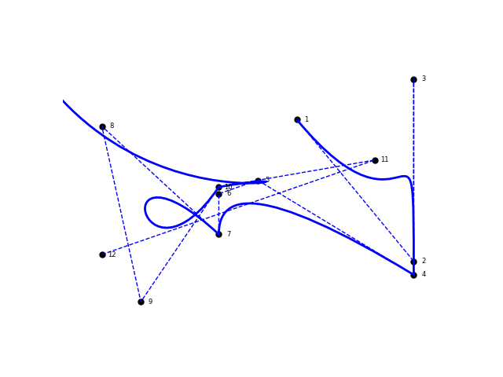
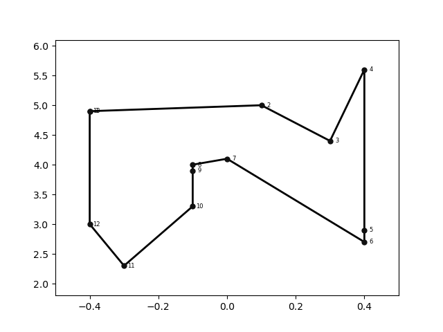
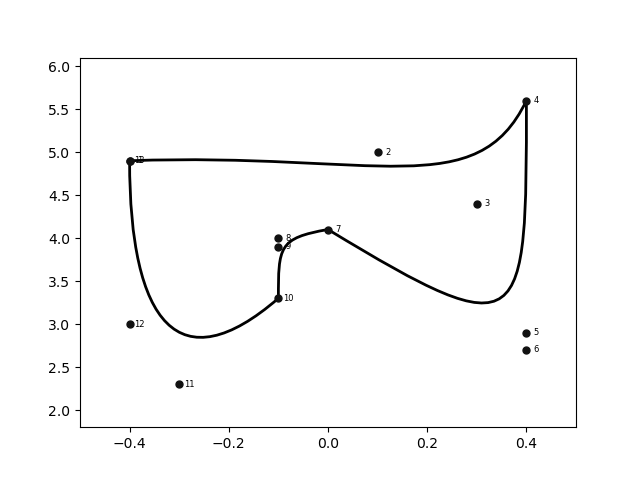

# The Avicii project: generating a signature from the songs on an album in Python

You can use this project to analyse music lyrics (text) for sentiment using Google Natural Language API.
It also allows you to visualise the results in a unique way.
I personally use the visuals to make my own t-shirts of musics that I like.


 [Read the origin story](http://www.edriessen.com/projects/the-avicii-project/) to find out why I created this project.

# Creating a unique dataviz of the lyrics of your favourite artist

Good to see that you want to give my repository a try. The process is split into two parts:

1. Analyse the song texts.
2. Visualisation to review the sentiment data.
3. Generate a signature from the data.

I'll use Avicii's posthumous album TIM as an example in this readme. 
You can see an example setup in `run-example.py`. 
Let's dig in.

# 1. Analyse the songtexts

To run an analysis, you'll need a connection to the Google Cloud Natural Language API. 
Set up a project in the Google Cloud console and add your `credentials.json` to the project root folder. 
After that, you'll need a `.txt` file for each song that you want to analyse. 
I use https://www.azlyrics.com to get my lyrics.

Format each `.txt` file like this: `song index-album name-song title.txt`. 

For the song Peace of Mind by Avicii, the first song on the album TIM, this would be: `1-tim-peace of mind.txt`. 
Store the text files of an albums inside the `songs` folder in my project. 

When you have the files ready, you can use `analyse_files_and_store_in_csv` from `analyse.py` to run the sentiment analysis and store the results in a csv file. 
The function takes two arguments:

- path to song files, e.g. `songs/avicii tim`.
- name of the csv file that will be stored in the output folder, e.g. `avicii tim`. 

A full example looks like this:

`analyse_files_and_store_in_csv('songs/avicii tim', 'avicii tim')`

### Scrape lyrics automatically from Genius.com
You have the option to scrape for the lyrics using the `lyrics.py` file. 
To use the script, you have to generate an access key on https://genius.com/api-clients.
Store the access key in a json file called `credentials-genius.json` with this format:

```
{
  "access-key": "your access key here"
}
```

After that, enter the song titles, artist, and album as appropriate in `lyrics.py`. 
You will need to create the appropriate folder under the songs folder (for example, for Lady Gaga, you will need to create a `Lady Gaga` folder: `songs/Lady Gaga`. 
The script will generate the text files and put them in the folder.

_Small changes in the lyrics can impact the visual.
So be sure to check the lyrics when you get them automatically._

# 2. Visualisation to review the sentiment data

You can visualise the data with the functions in `visualise.py`. 
The basic scatter plot allows you to get an understanding of results of the sentiment analysis.

You'll have to transform the generated data sheet into a dataframe first. 
You can do so using the standard Pandas `read_csv` function:

```
tim_df = pd.read_csv('output/avicii tim.csv').sort_values(by='index').reset_index()
```

Use the `scatter_plot_from_dataframe` function to create a scatter plot. 
It gives you an readable overview of the sentiment analysis' results. 
You only have to pass 1 value (a dataframe):

```
scatter_plot_from_dataframe(
    dataframe=tim_df,
)
```
Here's an example of the results:



The function has some optional extra values you can use:

```
scatter_plot_from_dataframe(
    dataframe=tim_df,
    magnitude_amplifier=0,
    album_color='purple',
    annotate='index',
    disable_grid=True,
)
```
Some details on the values:

- dataframe: the data frame you want to visualise.
- magnitude_amplifier: changes the size of a dot based on the magnitude.
- album_color: the color for the dots. Leave empty for sentiment colours red, grey, and green. 
- annotate: define how you'd like to annotate the dots. Use `'title'`, `'index'`, or `'index title'`. Leave empty for no annotation.
- disable_grid: do you want to hide the grid of the plot (`True`/`False`)?
- save (optional): pass to not show but save your file. Provide path, file name, and file type (e.g. `'path/scatterplot.png'`).
- fill (optional): set to `False` if you do not want to fill the dots and only fill the edge colors. 

Here's another example of the resulting dataviz from this function:



# 3. Generating an organic signature from the data 

This is where the magic happens. 
By drawing a line from one song to the next, based on the index on the album, we can generate an organic looking line.
A line that resembles a hand-drawn signature.
The project currently supports two types of line plots:

- 3.1 Line plot
- 3.1 Edge plot

Let's review them both in detail.

## 3.1 The line path of your favourite music

I'm starting to repeat myself, but this one feels magical to me. 
Using the patches option from Matplotlib, you can draw a line from one point to the next. 
In this case, each point is represented by the sentiment score (x) and the magnitued (y). 
By drawing Bézier curves in stead of straight lines, we get to the organic looking shape.
  
Use the `path_plot_from_dataframe` function to create the line. 
Again, you only have to pass a dataframe.

```
plot_path_from_dataframe(
    dataframe=df
)
```

And the result is: 


Wow, that is some nice abstract dataviz right?! :)

Also this function has some extra options. 
I've used these during testing to see if lines were drawn correctly. 
I decided to keep them in so you can get an understanding of how the drawing works. 
Here's an example of the function with all it's extra options set:

```
plot_path_from_dataframe(
  dataframe=df,
  show_dots=True,
  dot_color='black',
  disable_grids=True,
  line_types=['s', 'c'],
  line_colors=['blue', 'blue'],
  line_styles=['--', '-'],
  line_widths=[1,2],
)

```

Some details on the values:

- dataframe: the data frame you want to visualise.
- show_dots: do you want to show dots in this plot (`True`/`False`)?
- dot_color: set the color for the dots and dot labels, default `'black'`.
- disable_grids: do you want to hide the grid of the plot (`True`/`False`)?
- line_types: the list of line types you want to use. Use `'s'` or `'straight'` for a straight line. Default is curved (Bézier curves).
- line_colors: set the colours for the lines. Use supported default color label or hex colour, e.g. `'#ff0000'`. 
- line_styles: the list of line styles you want to use, for example `['-', '--']` for a solid and a dashed line.
- line_widths: the width of the lines you want to plot, for exameple `[1,2]`. 
- save (optional): pass to not show but save your file. Provide path, file name, and file type (e.g. `'path/coolpath.png'`).

_Make sure the lists you provide for the line_vars have the same length._

And again the result:



Here's another example that plots the same line several times with different colours and widths:

```
plot_path_from_dataframe(
  dataframe=df,
  line_types=['c', 'c', 'c', 'c', 'c', 'c'],
  line_colors=['#E6E6E6', '#F2C641', '#E52133', '#A40454', '#02388F', '#ffffff'],
  line_styles=['-', '-', '-', '-', '-', '-'],
  line_widths=[38,30,22,14,8,2],
)
```

And the image:


# 3.1 Edge Plot

I have included an option to draw a different kind of path. 
As discussed, the path is normally drawn based on the order of the songs on an album. 
But if you want, you can change it to an edge shape. 
This draws a line across the outermost points in the data set. 

Here's an example of the data of Avicii's TIM: 



And the version with a curved path:



Technically, it works like this:

- The script finds the data point with lowest score in the dataframe. 
If there are multiple, it selects the one with the highest magnitude.
- Next, it goes looking for the next data point with a higher score and higher magnitude. 
If there aren't any, it picks the nearest point with a higher score.
- After that, it keeps on looking for data points with a higher score and a max difference of 1.1 in magnitude. 
Again, if there aren't any matches, it picks the nearest point with a higher score.
- When there are no values with a higher scores left, it flips it search. Looking for lower scores and lower magnitudes.
This last check picks up all the remaining data points for the path.

When the edge path order is defined, it adds a copy of the first row of the dataframe as the last row. 
This closes the path into a full loop.

To use this edge path option, you have to filter the data frame. 
You can pass a `start_at` parameter, to have the path start at a point of choosing. 

```python
from custom_path import sort_df_by_starting_point

df = pd.read_csv('output/avicii tim.csv').sort_values(by='index')

df_filtered = sort_df_by_starting_point(
  df=df,
  start_at='bad-reputation'
)
```

I've used this edge path to make myself a Gorillaz album t-shirt. Read the story here: [Gorillaz T-Shirt Story](http://www.edriessen.com/2020/11/28/gorillaz-gorillaz-and-a-new-dataviz-t-shirt/).

# To do

Things I'll be working on are:

_Nothing. Feel free to contact me with requests._
